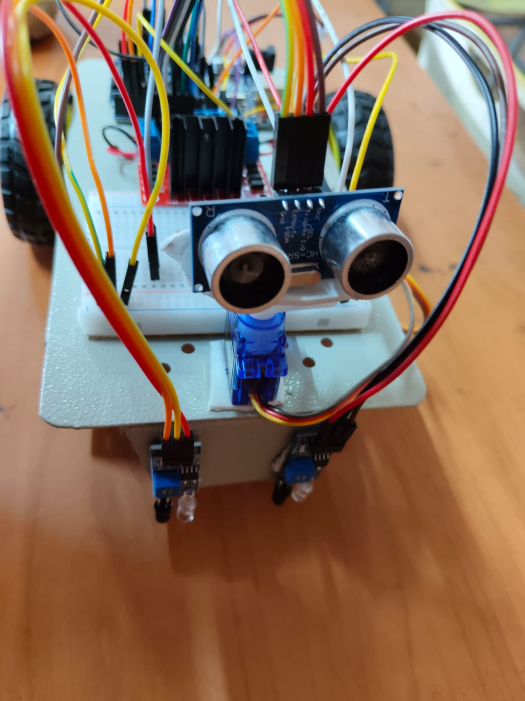

Line Follower Robot using Arduino

 Objective
To design a robot that follows a line using IR sensors.

 Components Used
- Arduino Uno
- L298N Motor Driver
- DC Motors
- IR Sensors
- Battery

 Working
The robot uses two IR sensors to detect the line and move accordingly.

 Logic
- LOW LOW → Forward
- HIGH LOW → Turn Left
- LOW HIGH → Turn Right
- HIGH HIGH → Forward

Project Images

 Applications
- Robotics
- Automation
